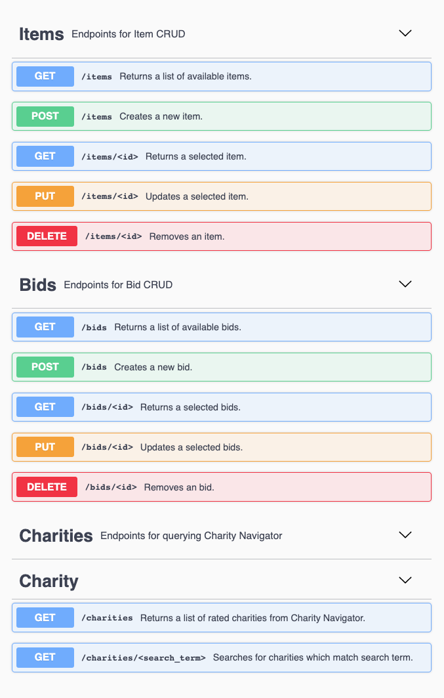
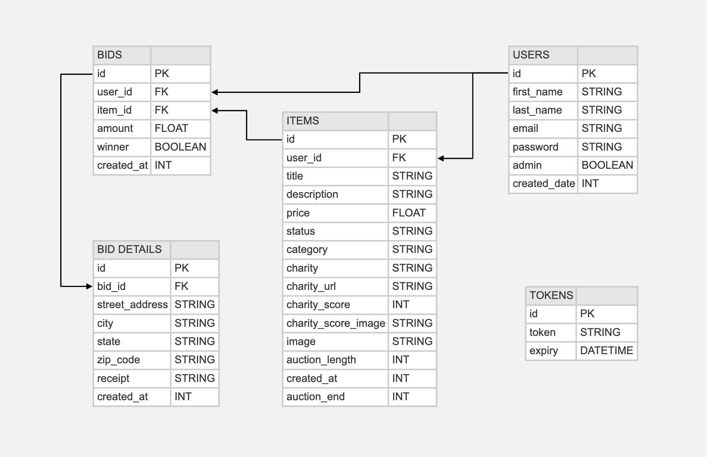

# Auctionable Change API [](https://travis-ci.com/Auctionable-Change/auctionable_change_api)

## Description

**Auctionable Change API** is the backend API for our [Turing School of Software and Design](https://turing.io/) capstone project, **Auctionable Change**.

The idea behind **A.change** is creating a platform in which an individual can donate to charity even when funds are low. A seller would post an unwanted or unneeded item for auction, set a minimum bid and then select a charity to which the funds from that item's auction would be donated. A bidder would then select an item and imput an amount greater than the minimum bid. After the alloted time frame a winning bidder is chosen and they are directed to place a donation at the proper charity, upload proof, and send shipping details to the seller so they may receive the item. All users must register and login to sell or bid to keep records of past and current bids. 

This **API** functions to consume a charity listing/ranking API and return that information to the front end, as well as provide full endpoints for creating, maintaining and accessing information within the database.

## Endpoints

Try It!: [Swagger Endpoint Diagrams](https://auctionable-change-api.herokuapp.com/swagger)




## Application Links

BE Production: https://auctionable-change-api.herokuapp.com/


FE Repo: https://github.com/Auctionable-Change/auctionable_change  

## Local Setup Instructions
#### Python and Flask Setup

- Clone this repo to your local machine using SSH:
  ```
  git clone git@github.com:Auctionable-Change/auctionable_change_api.git
  ```
- Navigate to the new directory:
  ```
  cd auctionable_change_api
  ```
- Set up virtual environment
  ```
  python3 -m venv venv
  . venv/bin/activate
  ```
- Install Flask (if necessary)
  ```
  pip install Flask
  ```
- Install packages in requirements.txt:
  ```
  pip install -r requirements.txt
  ```
- Set environment variables (place in an `.env` file at the root level)
  ```APP_SETTINGS="development"
  DATABASE_URL="postgresql://localhost/auctionable_change_api"
  FLASK_APP=app
  CHARITY_APP_ID=<register for your own>
  CHARITY_APP_KEY=<register for your own>
  ```

#### Database Setup


- Run the Alembic migrations to add tables to database:
  ```
  python manage.py db migrate
  python manage.py db upgrade
  ```

#### Starting Flask Server

- To run server on `localhost:5000/`:
  ```
  python run.py
  ```

## Testing and Coverage
- To run a testing and coverage report utilizing the included `coverage` module:
  ```
  nosetests --cover-package=application --with-coverage
  ```

## Dev Team BE

 - Stephanie Friend ([GitHub](https://github.com/StephanieFriend), [LinkedIn](https://www.linkedin.com/in/s-friend/))
 - Kevin McGrevey ([GitHub](https://github.com/kmcgrevey), [LinkedIn](www.linkedin.com/in/‎kevin-mcgrevey‎-8660958/))
 - Andrew Reid ([GitHub](https://github.com/reid-andrew), [LinkedIn](https://www.linkedin.com/in/reida/))

 ## Technologies and Frameworks

- Back-End
  - Language: Python 3.8.4
  - Framework: Flask 1.1.2
  - Testing: Nose
  - Database: PostgreSQL
  - Database Interaction & ORM: SQLAlchemy
  - Database Migrations: Alembic (via Flask-Migration wrapper)
  - API management: Flask-RESTful, Requests
- CI/CD
  - Continuous Integration: TravisCI
  - Deployment: Heroku
- Project Management
  - Kanban & Sprint Planning: Github Project Boards
  - Agile Planning & Retros: Miro
  - Communication: Zoom, Slack, Tuple
